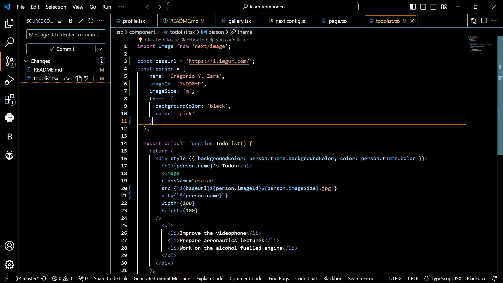

Soal 1
Ubah isi kode Home() sehingga dapat tampil seperti berikut dengan memanfaatkan komponen Profile() yang tadi sudah dibuat dari langkah 1 tersebut!

Capture hasilnya dan buatlah laporan di README.md. Jelaskan apa yang telah Anda pelajari dan bagaimana Anda solve error tersebut?

Jangan lupa push dengan pesan commit: "W03: Jawaban soal 1".

Catatan:

Jika terjadi error, Anda dapat mengakses tautan ini sebagai petunjuk solusinya: https://nextjs.org/docs/app/building-your-application/optimizing/images#remote-images

Jawaban : 

Jadi hal yang saya pelajari di praktikum 1 ini adalah cara membuat komponen dan memanggilnya ke main page.

Soal 2
Capture hasilnya dan buatlah laporan di README.md. Jelaskan apa yang telah Anda pelajari dan bagaimana tampilannya saat ini?

Jangan lupa push dengan pesan commit: "W03: Jawaban soal 2"

Jawaban :

Jadi hal yang saya pelajari di praktikum 2 ini adalah cara mengimpor dan mengekspor komponen dan memanggilnya di main page.

Soal 3
Silakan perbaiki kode JSX berikut ini. Anda boleh menggunakan konverter atau perbaiki secara manual.

Capture hasilnya dan buatlah laporan di README.md. Jelaskan apa yang telah Anda pelajari dan mengapa error itu bisa terjadi?

Jangan lupa push dengan pesan commit: "W03: Jawaban soal 3"

Soal 4
Kode di atas masih terdapat error, silakan diperbaiki.

Jangan lupa push dengan pesan commit: "W03: Jawaban soal 4".

Jawaban :

Soal 5
Buka file src/components/todolist.tsx lakukan ekstrak URL gambar ke dalam objek person.

Capture hasilnya dan buatlah laporan di README.md. Apakah ada perbedaan pada tampilan web saat ini?

Jangan lupa push dengan pesan commit: "W03: Jawaban soal 5".

Jawaban :

Tidak terdapat perbedaan dalam tampilan web.

Soal 6
Perbaiki kode tersebut pada bagian atribut src. Kode lainnya dapat Anda sesuaikan dari jawaban soal sebelumnya. Capture hasilnya dan buatlah laporan di README.md. Jelaskan apa yang telah Anda pelajari dan bagaimana tampilannya saat ini?

Jangan lupa push dengan pesan commit: "W03: Jawaban soal 6".

Catatan:

Untuk memeriksa apakah perbaikan Anda berhasil, coba ubah nilai dari imageSize menjadi 'b'. Gambar harus menyesuaikan ukuran setelah diubah.

Jawaban :

Yang telah saya pelajari di praktikum ini adalah menarik gambar dari web langsung dan merubah bentuk, ukuran, dan tempat sesuai yang diinginkan. Dan tampilan saat ini berubah dalam bentuknya menjadi lebih panjang.

